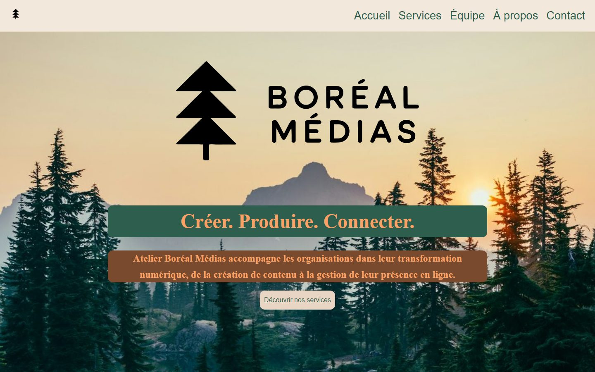

# Atelier Boréal Médias — site vitrine

Site vitrine de deux pages (accueil + contact) pour une entreprise **fictive**, réalisé en **HTML et CSS uniquement** (sans JavaScript).

> **English summary:** two-page showcase website for a fictional Montréal digital studio, built with plain HTML5 and CSS3 (Flexbox, Grid, CSS variables, responsive layout) during my web development training. No JavaScript, no framework. The contact form is a static demo and does not send anything.



**Démo en ligne :** https://kjustbou.github.io/ProjetWEBABM/

## Contexte

Projet de synthèse du cours **DEVWEB01** (programme Initiative Avenir, Cybercap), l'un de mes premiers projets web. Le mandat : à partir d'une maquette (wireframe) et d'un contenu textuel fournis, construire un site vitrine en respectant les modes de mise en page demandés pour chaque section. Le JavaScript n'avait pas encore été abordé.

## Pages et sections

**Accueil** (`index.html`)

| Section | Mise en page |
|---|---|
| En-tête + navigation | Flexbox |
| Bannière (hero) avec texte superposé à l'image | HTML/CSS standard |
| Services (3 cartes égales) | Grid |
| À propos (texte + image) | Flexbox |
| Équipe (grille 2×2) | Grid |
| Pied de page | Flexbox |

**Contact** (`index-contact.html`) : formulaire centré (nom, courriel, message).

## Ce que j'ai pratiqué

- HTML5 sémantique (`header`, `nav`, `main`, `section`, `footer`, `address`), textes alternatifs, attribut `lang`
- Formulaire accessible : `label` lié à chaque champ, types appropriés (`email`), validation native du navigateur (`required`) sans JavaScript
- CSS : variables personnalisées (palette et typographies), Flexbox, Grid, `object-fit`, image de fond
- Design adaptatif (*responsive*) avec `@media` : affichage ordinateur, tablette et téléphone
- Polices Google Fonts (IBM Plex Serif / IBM Plex Sans)
- Optimisation des images (redimensionnement et compression)
- Git et GitHub : travail sur une branche, puis fusion dans `main`

## Structure du projet

```
├── index.html            Page d'accueil
├── index-contact.html    Page de contact
├── vitrine-style.css     Feuille de style commune aux deux pages
├── images/               Logos et photos
├── instruction/          Documents fournis par la formation (contenu textuel, wireframe)
└── docs/                 Capture d'écran du README
```

## Voir le site en local

Aucune installation requise : ouvrir `index.html` dans un navigateur.
(Avec VS Code, l'extension *Live Server* fonctionne aussi.)

## Limites connues

- Le **formulaire de contact est une démonstration** : les champs sont validés par le navigateur (HTML5), mais le message n'est envoyé nulle part, faute de serveur.
- Le contenu (entreprise, équipe, adresse, courriel) est **fictif**.
- Le design est volontairement simple ; c'est un projet d'apprentissage.

## Crédits

- Maquette, contenu textuel, logos et photos : fournis par la formation, utilisés ici à des fins pédagogiques uniquement. Ne pas les réutiliser sans vérifier leur licence d'origine.
- Polices : [IBM Plex](https://fonts.google.com/?query=IBM+Plex) (licence SIL Open Font).

Réalisé par [kjustBou](https://github.com/kjustBou).
